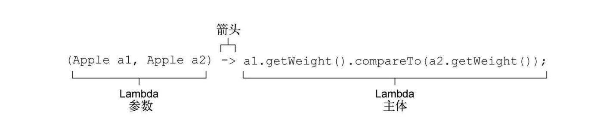

## 1.什么是lambda表达式？

lambda可以理解为简洁的式来表达的匿名函数：它没有名称，但它有参数列表、函数主体、返回类型，可能还有一个可以抛出异常的列表。

## 2.lambda的组成部分



1. 参数列表：这里代表的是这个函数中需要传入的参数。
2. 箭头的作用是把`参数`和`lambda主体`分开。
3. lambda主体：用来做逻辑处理，图片所示代表是返回的一个int值。

总结来说，lambda表达式语法可以是`(parameters)-> { statements; }`

## 3.使用lambda表达式的条件

接口中中有且只有一个未实现的方法，这其中包括jdk8以后，接口中可以有default的默认方法可以不计入其中。

那么以下那个是函数式接口呢？

```java
          public interface Adder{
              int add(int a, int b);
          }
          public interface SmartAdder extends Adder{
              int add(double a, double b);
          }
          public interface Nothing{
          }
```

答案：只有Adder。因为SmartAdder定义了两个抽象方法。其中一个式继承过来的。而Nothing接口不满足函数式接口，因为其中没有任何一个抽象方法。

其中java自带了很多函数式接口，它们在`java.util.function`这个包下面。

## 4.如何校验这个接口是不是函数式接口？

使用`@FunctionalInterface`函数来表示。

## 5.函数式接口的好处是什么呢？

可以大大简化开发人员的代码量，并且可以让代码变的极其的简单。比如有个函数式接口，如果你想有多个不同的实现方法，你可能需要写多个实现类，调用不同实现类来实施不同的业务逻辑。但是现在你可以通过函数式接口的lambda来实现，从而无需写多个实现类。


生活如此美好，何必天天烦恼！